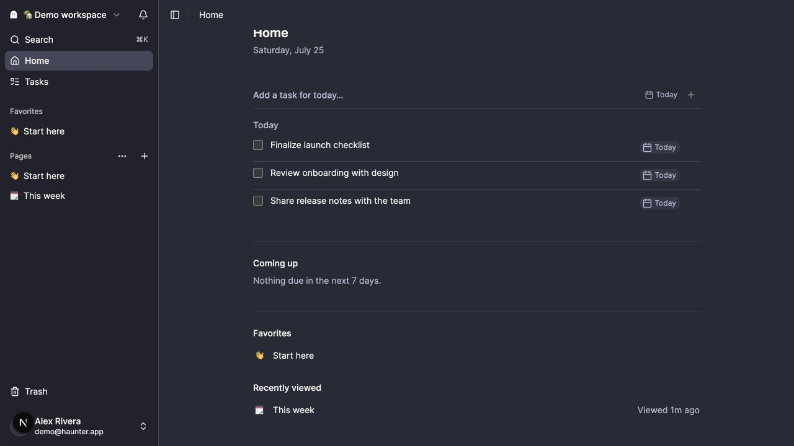
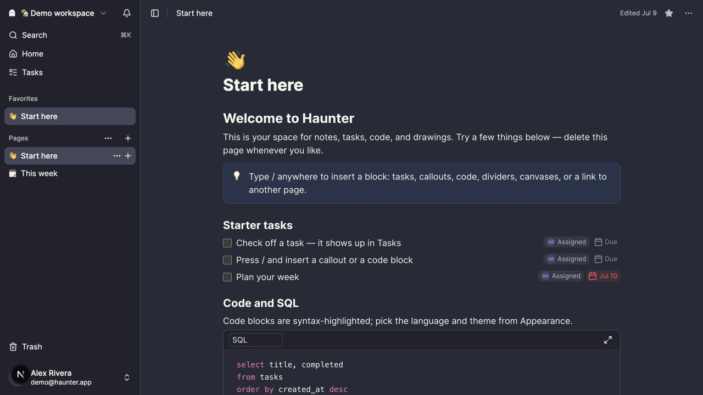

# Haunter 

A personal notes app — Notion-style nested pages and block editor, Todoist-style
tasks that roll up into a focused Home dashboard and per-workspace Tasks view,
syntax-highlighted code/SQL blocks, and embedded tldraw canvases. Built on [Beignet](https://beignetjs.com)
(contract-first, scaffolded with `@beignet/cli`).





## Features

- **Workspaces** separate work and personal notes; each has its own page tree
  and task list.
- **Home** keeps overdue, due-today, and near-term tasks beside favorite and
  recently viewed pages in a focused dashboard.
- **Pages** nest arbitrarily and are edited with a BlockNote editor
  (headings, lists, code blocks with shiki highlighting, tasks, canvases) that
  autosaves with a debounce.
- **Tasks** exist two ways: task blocks inside pages (reconciled into task rows
  on every content save, keyed by the block's own id) and standalone quick-add
  tasks. Toggling a task in Tasks writes through to the source page
  document; toggling in the editor syncs on autosave.
- **Notifications** surface assigned overdue tasks in-app after 9:00 AM in the
  user's timezone, with optional Web Push for subscribed devices.
- **Canvases** are tldraw documents embedded as blocks; snapshots persist
  per-canvas with a debounce, and the tldraw chunk loads only when a canvas
  block renders.
- **AI agents** connect through a hosted, OAuth-authenticated MCP server or the
  local Agent Auth bridge. Users choose a permission profile and workspaces,
  can review activity, and can disconnect a client immediately.

## Getting started

```bash
bun install
cp .env.example .env.local
```

For a fresh installation, set `BOOTSTRAP_ADMIN_EMAIL` in `.env.local` to the
email address that should own the installation. After that address completes
OTP verification, Haunter approves it as the first app-wide administrator. The
setting is ignored once an approved administrator exists.

## Prepare the database

```bash
bun beignet db migrate
```

The repository keeps every Drizzle migration in `drizzle/`; a clean database
applies the full checked-in migration history, while an existing database only
applies migrations it has not seen. After changing `infra/db/schema/`, run
`bun beignet db generate` and `bun beignet db migrate` together.

## Start the app

```bash
bun run dev
```

Open http://localhost:3000/sign-in and request a code for the configured
bootstrap email. In local development, the code is printed in the server
console. Verifying it creates the approved administrator account and continues
through workspace onboarding.

If the account was created before `BOOTSTRAP_ADMIN_EMAIL` was configured, leave
it on the waitlist and run the recovery task:

```bash
bun run bootstrap-admin --email owner@example.com
```

The task only promotes an OTP-verified account when no approved administrator
exists. Sign out from the waitlist page and sign back in after it completes so
the browser receives a session containing the new access status.

## First checks

```bash
# in another terminal
bun beignet routes
bun run lint
bun beignet lint
bun beignet doctor --strict
bun run test
bun run typecheck
```

`routes` shows the contracts Beignet can inspect. `bun beignet lint` checks dependency direction. `doctor --strict` catches route, OpenAPI, and resource drift and treats warnings as failures.
`bun run lint` runs Biome over the starter; use `bun run format` to apply formatting.

## Coding agents

This app trusts Beignet package skills through `package.json#intent.skills`.
Run `bunx @tanstack/intent@latest install` to add Intent's managed skill-loading block
to your agent config, then load matching package skills before substantial
Beignet changes. The generated `AGENTS.md` and `CLAUDE.md` stay short and
point agents at app-local conventions, generators, validation, and MCP tools.

## Build for production

```bash
bun run build
bun run start
```

## Generate a feature

```bash
bun beignet make feature projects
bun beignet db generate
bun beignet db migrate
bun run test
bun run lint
bun run typecheck
bun beignet lint
bun beignet doctor --strict
```

`make feature` creates a contract-to-test vertical slice with Drizzle schema and repository files, so regenerate and migrate the database before running the app against the new feature.
Use `bun beignet make feature projects --recipe full-slice` when you want a richer reference slice with policy, feature client helpers, workflow artifacts, events, listener registration, jobs, and outbox wiring.

## App map

- `features/admin/`, `features/agents/`, `features/canvases/`,
  `features/notifications/`, `features/pages/`, `features/shares/`,
  `features/tasks/`, and `features/workspaces/` are server-backed product
  slices. Each owns only the contracts, schemas, ports, policies, use cases,
  routes, client helpers, components, workflows, and tests its behavior needs.
- `features/collab/`, `features/home/`, `features/members/`, and
  `features/waitlist/` are supporting slices that compose existing contracts,
  provide focused ports or helpers, or own route-level UI. They intentionally
  do not mirror a full server slice.
- `features/shared/` contains the small cross-feature error and authorization
  primitives; feature-specific behavior stays with its owning slice.
- `features/pages/components/editor/schema.ts` is the single extension point
  for the block model (code block config, task block, canvas block). Future
  executable cells plug in here as a new block spec.
- `features/tasks/lib/` holds the pure document-walking helpers
  (`extract-task-blocks`, `patch-task-block`, `reconcile-page-tasks`) that keep
  task rows and page documents in sync. The reconciliation runs inside the
  `pages.saveContent` transaction.
- `ports/` defines app-owned dependencies (repositories, gate, auth).
- `infra/` implements ports: one Drizzle repository per feature under
  `infra/<feature>/`, wired in `infra/db/repositories.ts`.
- `infra/db/schema/` contains the Drizzle schema, `drizzle/` contains the checked-in migrations.
- `server/routes.ts` keeps the central route registry and OpenAPI contract list.
- `server/schedules.ts` and `server/tasks.ts` register operational workflows.
- `server/context.ts` declares the context blueprint shared by the server and route tests.
- `server/providers.ts` wires devtools, Better Auth, pino, Drizzle/libSQL, and the starter database provider.
- `lib/env.ts` validates deployment configuration at startup.
- `lib/auth.ts` exposes `requireUser(ctx)` for protected use cases.
- `lib/better-auth.ts` owns Better Auth setup and keeps provider-specific auth details outside use cases.
- `app/(auth)/` and `app/(app)/` own the sign-in/sign-up pages and the authenticated shell.
- `components/` owns the app shell and shadcn/ui primitives.
- `client/` owns the typed API client, React Query helpers, and the Better Auth client.
- `features/<feature>/client/` may own feature-specific data-fetching helpers and hooks.

## Notification deployment

The hourly workflow in `.github/workflows/overdue-notifications.yml` calls the
protected overdue-task schedule. Configure these GitHub Actions values:

- Repository secret `CRON_SECRET`: the same non-empty value as `CRON_SECRET`
  in the deployed app.
- Repository variable `APP_URL`: the deployed origin, such as
  `https://haunter.example.com`. It defaults to `https://www.haunter.app` for
  this repository. Use the canonical origin directly; redirects are treated as
  failures so the authorization header is never forwarded across hosts.

In-app overdue notifications are created by that schedule. To also deliver Web
Push while Haunter is closed, generate a VAPID key pair and set all three
values in the deployed app:

```bash
bunx web-push generate-vapid-keys
```

```env
WEB_PUSH_PUBLIC_KEY=...
WEB_PUSH_PRIVATE_KEY=...
WEB_PUSH_SUBJECT=mailto:notifications@example.com
```

Without the VAPID configuration, the notification center still works and push
delivery is skipped. Users enable push separately for each device in Settings.

## Before deploying

- Keep `SQLITE_DB_URL=file:local.db` for local libSQL development or point it at a hosted libSQL database such as Turso.
- Run `bun beignet db generate` and `bun beignet db migrate` after changing the Drizzle schema.
- Run `bun beignet db reset` to rebuild a local SQLite database from the checked-in migrations.
- Remove `DEVTOOLS_ENABLED=true` in production unless you add authentication and stricter redaction.
- Set `APP_URL`, `BETTER_AUTH_SECRET`, `LOG_LEVEL`, and service-specific integration variables in your hosting environment.
- Configure the notification schedule and VAPID values above if overdue reminders should run in production.
- On a fresh installation, set `BOOTSTRAP_ADMIN_EMAIL` before the owner first signs in; leave it unset on established installations.
- Keep `APP_URL` set to the canonical deployed origin. `BETTER_AUTH_URL` is an
  optional override when Better Auth has a different public origin.
  When Vercel's system environment variables are exposed, deployment, branch,
  and production hosts are admitted automatically. Set
  `BETTER_AUTH_ALLOWED_HOSTS` to comma-separated hostname patterns for
  additional aliases, other hosting providers, or Vercel projects that do not
  expose system variables. Use
  `BETTER_AUTH_TRUSTED_ORIGINS` only for separate client origins that call the
  auth server.
- Hosted MCP defaults to `${APP_URL}/mcp`. Set `MCP_RESOURCE_URL` when clients
  should use a different stable public endpoint. It is also the OAuth token
  audience, so it must match exactly and should not redirect. Browser-based
  MCP clients with a separate origin must be listed in `MCP_ALLOWED_ORIGINS`;
  native and server-side clients generally do not send an `Origin` header.
- Apply the checked-in OAuth/MCP migration before enabling hosted MCP. The
  authorization server publishes discovery below `/.well-known/`, while the
  transport itself is served at `/mcp`.
- Review the starter authorization policy before exposing user-owned data.
